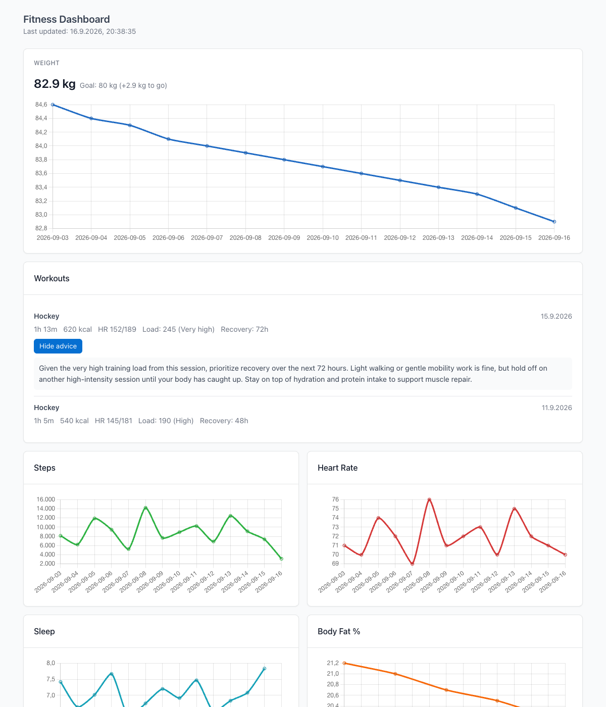
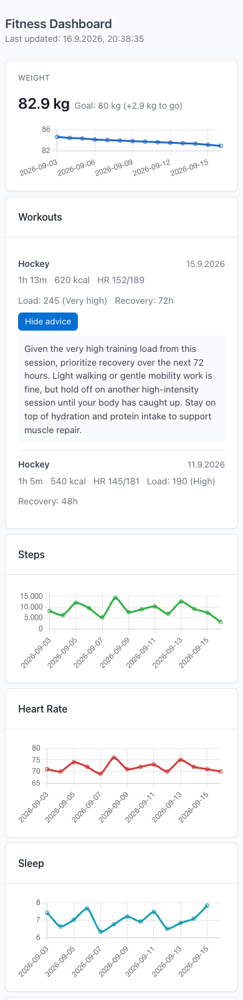

# Fitness Dashboard

A personal fitness dashboard that turns Apple Health and hockey workout
data into trend charts and AI-generated coaching advice — running
entirely on Cloudflare's edge (Pages Functions, D1, R2, Workers AI).

**Live demo:** [fitness-dashboard-6ih.pages.dev](https://fitness-dashboard-6ih.pages.dev)
*(this is a real, continuously-updating personal dashboard — the numbers you see are my actual data)*



<details>
<summary>Mobile view</summary>



</details>

## What it does

- **Trend tracking** — weight (with a goal line), steps, heart rate,
  sleep, and body fat percentage, charted over a rolling 30-day window.
- **Hockey workout capture** — Mi Fitness/Zepp Life track richer workout
  stats (Training Load, Recovery, Training Effect, Vitality Score) than
  Apple Health syncs. Rather than build a native integration, an iOS
  Shortcut shares Mi Fitness's own workout-summary card image to the
  dashboard, which uses **Workers AI vision** (`mistral-small-3.1-24b`)
  to extract the structured stats directly from the screenshot.
- **AI coaching advice** — the moment a workout is captured, a second
  Workers AI call generates recovery/training/nutrition advice, using
  the new workout plus the athlete's last 14 days of trend data as
  context. Shown as a collapsed "View advice" toggle under the workout.
- **Workout card thumbnails** — the original shared image is stored in
  R2 and shown as a thumbnail on the dashboard.

## Architecture

```
                     ┌─────────────────────────┐
  Apple Health  ───▶ │ Health Auto Export (iOS) │──▶ POST /api/ingest ──┐
                     └─────────────────────────┘                       │
                                                                        ▼
  Mi Fitness   ───▶  iOS Shortcut (share sheet)                  Cloudflare D1
  workout card        │                                          (daily_metrics,
                       ▼                                           workouts, goals)
                 POST /api/workouts/ingest                             ▲
                       │                                               │
                       ▼                                               │
              Workers AI (vision) ──▶ extract workout stats ───────────┤
                       │                                               │
                       ▼                                               │
              Workers AI (text) ──▶ generate coaching advice ──────────┘
                       │
                       ▼
                 R2 (workout card image)


  Browser ──▶ GET /api/metrics, /api/workouts, /api/goals ──▶ dashboard.js + Chart.js
```

Everything runs as Cloudflare Pages Functions (TypeScript) behind a
single Pages project — no separate backend service, no servers to
manage.

## Tech stack

| Layer | Choice |
|---|---|
| Hosting / API | Cloudflare Pages Functions |
| Database | Cloudflare D1 (SQLite) |
| Object storage | Cloudflare R2 (workout card images) |
| AI | Cloudflare Workers AI (`mistral-small-3.1-24b-instruct`, vision + text) |
| Frontend | Vanilla JS, [Chart.js](https://www.chartjs.org/), [Tabler](https://tabler.io/) (CSS only, via CDN — no build step) |
| Testing | [Vitest](https://vitest.dev/), with D1/R2 faked via `better-sqlite3` |
| Data source | [Health Auto Export](https://www.healthyapps.dev/) (iOS) + an iOS Shortcut sharing Mi Fitness workout screenshots |

**Design pattern worth calling out:** both AI calls (vision extraction
and advice generation) are written as injectable function types
(`VisionExtractor`, `AdviceGenerator`) rather than hardcoded Workers AI
calls. Tests inject fakes; the real implementation is the only place
that knows about Workers AI. This is what made it possible to build and
test the AI-advisor feature without ever calling a real model in CI,
and keeps a future swap to a different provider a contained change.

## Project layout

```
functions/
  api/
    ingest.ts              POST /api/ingest            (Health Auto Export → daily_metrics)
    metrics.ts              GET /api/metrics
    goals.ts                 GET/POST /api/goals
    workouts.ts               GET /api/workouts
    workouts/
      ingest.ts             POST /api/workouts/ingest   (workout image → vision + advice)
      image.ts               GET /api/workouts/image    (serves the R2 thumbnail)
  _lib/
    vision.ts               Workers AI vision extraction (VisionExtractor)
    advice.ts                Workers AI advice generation (AdviceGenerator)
    advice-context.ts        builds the 14-day trend context for a workout
    workout-parse.ts         normalizes extracted workout fields
    payload.ts                parses Health Auto Export's export payload
    db.ts / workouts-db.ts     D1 access, upsert-by-natural-key semantics
    image-store.ts            R2 key naming
    auth.ts                   shared-secret request auth
    types.ts                  shared types (Env, row shapes)
public/
  index.html / dashboard.js / styles.css     the dashboard itself
tests/                        one test file per _lib/api module
schema.sql                    D1 schema
seed.local.sql                mock data for local dev (see below)
```

## Running it yourself

### Prerequisites

- A Cloudflare account (Pages, D1, R2, and Workers AI are all on the free tier)
- Node.js 20+
- [`wrangler`](https://developers.cloudflare.com/workers/wrangler/) (installed as a dev dependency, invoked via `npx`)

### Local development

```bash
npm install
npx wrangler d1 execute fitness-dashboard-db --local --file=schema.sql
npx wrangler d1 execute fitness-dashboard-db --local --file=seed.local.sql   # optional: populates mock data
npm run dev
```

`seed.local.sql` fills a local D1 instance with ~2 weeks of synthetic
metrics and two mock workouts (including AI advice text) so the
dashboard renders something meaningful without needing real health data
or a Workers AI call — this is exactly how the screenshots above were
generated.

### Tests

```bash
npm test        # 96 tests, D1/R2 faked with better-sqlite3 — no network calls
npx tsc --noEmit
```

### Deploying your own copy

```bash
npx wrangler d1 create fitness-dashboard-db          # update wrangler.toml with the returned database_id
npx wrangler r2 bucket create fitness-dashboard-workout-images
npx wrangler d1 execute fitness-dashboard-db --remote --file=schema.sql
npx wrangler pages project create fitness-dashboard
npx wrangler pages secret put INGEST_SECRET --project-name=fitness-dashboard
npm run deploy
```

`wrangler.toml`'s D1/R2 identifiers aren't secrets (Cloudflare doesn't
treat them as such) — the only real secret, `INGEST_SECRET`, lives
exclusively in Cloudflare's encrypted secret store and is never
committed. Point Health Auto Export's REST API export and the workout
iOS Shortcut at `https://<your-project>.pages.dev/api/ingest` and
`/api/workouts/ingest` respectively, both authenticated with an
`X-Ingest-Secret` header.

## Why this exists

Apple Health captures the day-to-day (weight, steps, heart rate,
sleep) well, but the hockey-specific training metrics I actually care
about — Training Load, Recovery time, Vitality Score — only live inside
Mi Fitness and never sync to Apple Health. Rather than fight that
integration, this project leans into AI to bridge it: read the
numbers straight off the app's own summary screenshot, then use the
same model to turn "training load 245, recovery 72h" into advice I'd
actually act on.

## Built with Claude Code

This project was built end-to-end in collaborative sessions with
[Claude Code](https://claude.com/claude-code) — from the initial
brainstorm through spec, implementation plan, subagent-driven
execution with code review at every step, to production deploys. The
git history reflects that process (small, reviewed, incrementally
shipped commits) rather than one large drop.
